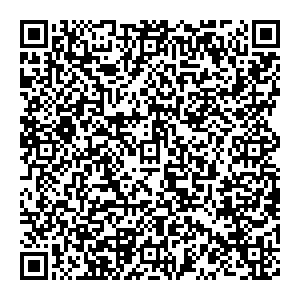
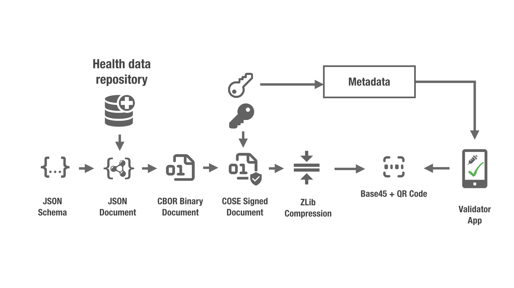

# Inside EU Digital Covid Certificates QR Codes


Since a couple of weeks the residents of Luxembourg we starting recieving European Digital Covid Certificates.

These certificates aims easing some of the hassles while travelling inside EU and also improving some security aspects.

Before the introduction of the Digital Covid Certificates it was pretty simple to forge test results. Any person could edit a pdf document and it was hard for foreign authorities to assert the integrity of a pdf document shown from a phone or printed.

There have been a number of cases reflected in media about people forging their PCR and other tests. Even people selling fake covid negative tests.

## What's a EU Digital Covid Certificate?

According to the official information:
```
How does the EU Digital Covid Certificate work?

The certificate will make it easier for you to travel safely through the EU by showing that you have been vaccinated, had a negative test result or recovered from Covid-19 in the last six months.


It will be issued by national authorities.


This information will take the form of a QR code, which can be electronic (on your smartphone or tablet, for instance) or printed and scanned when travelling.


The certificate should be available from 1 July and will be free.


The system will be in place for 12 months and cover all 27 EU countries as well as Iceland and Lichtenstein. Norway and Switzerland.
```
[Travel safely with the EU Digital Covid Certificate](https://www.europarl.europa.eu/news/en/headlines/priorities/eu-response-to-coronavirus/20210520STO04404/travel-safely-with-the-eu-digital-covid-certificate)

## Not just a simple QR code



To my surprise when scanning this QR code with the camera application from Android I get something like:

```
HC1:6BFOXN%TSMAHN-H+QC3W9ULE $HXOE1V8H%BZEJQM2XG4L9EWEFTSJ.ROPRHK1JZZPQA36S4HZ6SH9+2Q9L6O-Q.A12:6NP6GLU KULAVXM61+U6-60T932Q%RTKK9+OC+G9QJPNF67J6QW6-.QY466PP3.594VUWU%Y1.LH:HUNRAY9ED%USMU*PP:+P*.1D9R$P6*C0QJ22 UK*RAQ3:DKZSVV*001H--8UE9GB55B9-NT0 2$$0X4PCY0+-CVYCRMTB*05*9O%0HJP7NVDEB$/IQ7TSY0N48:PI/E2$4JY/KWYCL-27/B*ZJ9UJE7J92KY6TLOJH7JPOJC0J/KICT3KVTXPTPTT:ZJ83BO8TGVTCET6NJF0JEYI1DLNCK162:362LCB2FM5CYZCQ8132A0JMGMUCJ2X-9.3MICEHSSND3US3SQ56TKLYA43W VN4*VNO8FZN+F8YTEI6R*9OVEJ:/E0.16-IOJL O4XOF:MD
```

I was expecting to see something a bit more user friendly. Maybe a link taking me to an official website for checking the integrity of the certificate. 

What's this cryptic content?
After checking these sources I guess we can already start decoding what comes out from the QR scanner.

- [European eHealth Network](https://github.com/ehn-dcc-development)
- [EHN Trivial Example](https://github.com/ehn-dcc-development/ehn-sign-verify-python-trivial)
- [Electronic Health Certificates](https://github.com/ehn-dcc-development/hcert-spec)

To summarize, this is how the certificate gets into a QR code.

 Source: https://github.com/ehn-dcc-development/hcert-spec


So to decode the QR code we have to go backwards.

- Base45 Decoding [Base 45 Lib](https://pypi.org/project/base45/)
- Zlib Decompression
- COSE Message Parsing [Cose Lib](https://pypi.org/project/cose/)
- CBOR Binary Extraction [CBOR2 Lib](https://pypi.org/project/cbor2/)

```python
#!/usr/env python
from cbor2 import dumps, loads
from zlib import decompress
from base45 import b45decode
from binascii import hexlify, unhexlify
import cose.messages.sign1message as s1m

qr = '6BFOXN%TSMAHN-H+QC3W9ULE $HXOE1V8H%BZEJQM2XG4L9EWEFTSJ.ROPRHK1JZZPQA36S4HZ6SH9+2Q9L6O-Q.A12:6NP6GLU KULAVXM61+U6-60T932Q%RTKK9+OC+G9QJPNF67J6QW6-.QY466PP3.594VUWU%Y1.LH:HUNRAY9ED%USMU*PP:+P*.1D9R$P6*C0QJ22 UK*RAQ3:DKZSVV*001H--8UE9GB55B9-NT0 2$$0X4PCY0+-CVYCRMTB*05*9O%0HJP7NVDEB$/IQ7TSY0N48:PI/E2$4JY/KWYCL-27/B*ZJ9UJE7J92KY6TLOJH7JPOJC0J/KICT3KVTXPTPTT:ZJ83BO8TGVTCET6NJF0JEYI1DLNCK162:362LCB2FM5CYZCQ8132A0JMGMUCJ2X-9.3MICEHSSND3US3SQ56TKLYA43W VN4*VNO8FZN+F8YTEI6R*9OVEJ:/E0.16-IOJL O4XOF:MD'
msg = s1m.Sign1Message.decode(decompress(b45decode(qr)))
obj = loads(msg.payload)
```

That snipet of code will get us this, awesome!
```python
print(obj)

{1: 'LU',
 4: 1623369599,
 6: 1623314778,
 -260: {1: {'v': [{'ci': '01/LU/162LOPKOKV5AO#49',
     'co': 'LU',
     'dn': 1,
     'dt': '2021-05-01',
     'is': 'MINISTRY OF HEALTH',
     'ma': 'ORG-100001417',
     'mp': 'EU/1/20/1525',
     'sd': 1,
     'tg': '840539006',
     'vp': 'J07BX03'}],
   'dob': '1987-08-10',
   'nam': {'fn': 'Spécimen',
    'gn': 'Jeanne',
    'fnt': 'SPECIMEN',
    'gnt': 'JEANNE'},
   'ver': '1.0.0'}}}
```

### What are all these keys and values?

Source: [Schema](https://ec.europa.eu/health/sites/default/files/ehealth/docs/covid-certificate_json_specification_en.pdf)
- 1: _LU_  Country code
- Expiry Date _1623369599_ '2021-06-11T01:59:59'
- Issued _1623314778_ '2021-06-10T10:46:18'
- _nom_: Name information
- _dob_: Date of Birth
- _ci_: This is the actual certificate
- _co_: Country
- _dn_: Doses recieved
- _dt_: Date of Vaccination
- _is_: Institution issuing the certificate
- _ma_: Vaccine Manufacturer
- _mp_: Vaccine Product ID
- _sd_: Number of Doses
- _tg_: Targeted Disease (Covid 19)
- _vp_: Vaccine
- _ver_: Schema version

### Some questions I asked myself while looking into EU covid QR Codes

- Why Base45?

    Qr and Aztec code have a specific, highly efficient, method for storing alphanumeric characters (MODE 2/0010).

    In particular compared to UTF-8 (where the first 32 characters are essentially unused; and successive non-latin characters lose an additional 128 values as the topmost bit needs to be set).

    Details of this "11 bits per two characters" encoding can be found at

    -	 https://www.thonky.com/qr-code-tutorial/alphanumeric-mode-encoding
    -	https://raw.githubusercontent.com/yansikeim/QR-Code/master/ISO%20IEC%2018004%202015%20Standard.pdf - section 7.44 on page 26

    For this reason, the industry generally encodes these in base45. A document for this de-facto standard is in progress:

    - [Internet Draft draft-faltstrom-base45](https://datatracker.ietf.org/doc/draft-faltstrom-base45)

    Source: https://github.com/ehn-dcc-development/hcert-spec/blob/main/README.md

- Privacy Concerns
    - Seems not a lot of personal data is available in the QR code, anyone capturing QR codes will only be able to retrieve country of residence, name and date of birth.

- Integirty and Data origin authentication
    - One of the main concerns is that people can forge easily covid documentation. This effort to standarize and sign the certificates seems in the right direction. There are many official apps to do this, however, I would like to be able to verify certificates with my own code.

    If we try to verify a message using cose, there is a method for this.
    ```python
    qr = '6BFOXN%TSMAHN-H+QC3W9ULE $HXOE1V8H%BZEJQM2XG4L9EWEFTSJ.ROPRHK1JZZPQA36S4HZ6SH9+2Q9L6O-Q.A12:6NP6GLU KULAVXM61+U6-60T932Q%RTKK9+OC+G9QJPNF67J6QW6-.QY466PP3.594VUWU%Y1.LH:HUNRAY9ED%USMU*PP:+P*.1D9R$P6*C0QJ22 UK*RAQ3:DKZSVV*001H--8UE9GB55B9-NT0 2$$0X4PCY0+-CVYCRMTB*05*9O%0HJP7NVDEB$/IQ7TSY0N48:PI/E2$4JY/KWYCL-27/B*ZJ9UJE7J92KY6TLOJH7JPOJC0J/KICT3KVTXPTPTT:ZJ83BO8TGVTCET6NJF0JEYI1DLNCK162:362LCB2FM5CYZCQ8132A0JMGMUCJ2X-9.3MICEHSSND3US3SQ56TKLYA43W VN4*VNO8FZN+F8YTEI6R*9OVEJ:/E0.16-IOJL O4XOF:MD'
    msg = s1m.Sign1Message.decode(decompress(b45decode(qr)))
    msg.verify_message()
    ```
    However, it will raise an exception if the key is not provided, which I couldn't find anywhere in the public data available.


